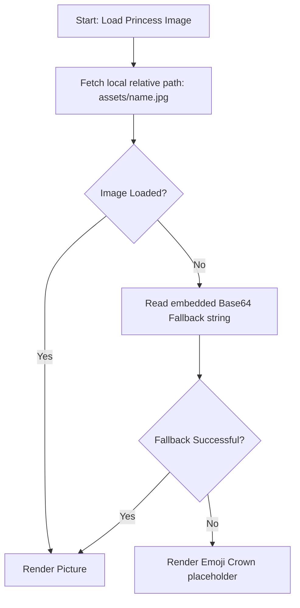

# Zoe's Princess Academy — Design & Style Guide

Welcome to the official design specification and style guide for **Zoe's Princess Academy**. This document outlines the visual brand identity, design tokens, layout grids, components, asset pipeline, and responsiveness paradigms that define the application's look and feel. 

---

## 1. Visual Brand Identity & Design Tokens

Zoe's Princess Academy merges child-friendly gamification with clear, readable educational layouts. The visual design centers around a magical princess aesthetic, using soft pastel gradients, gold framing accents, rounded shapes, and playful micro-animations.

### 1.1 Color Systems & Gradients

The application utilizes specialized gradients to define spatial boundaries, rooms, and curriculum subjects:

| Theme/Role | CSS Value / Hex | Preview / Context |
| :--- | :--- | :--- |
| **Global Background** | `linear-gradient(135deg, #fdfcfe 0%, #f4faeb 50%, #e6f7ff 100%)` | Magical pastel canvas backdrop |
| **App Frame Border** | `#ebd373` | Gold accent framing for viewports |
| **Focus Indicator** | `rgba(14, 165, 233, 0.55)` | Sky blue border for high accessibility |
| **Reading (ELA)** | `linear-gradient(135deg, #60a5fa, #3b82f6)` | Belle's Library theme |
| **Math** | `linear-gradient(135deg, #f472b6, #db4f9c)` | Elsa's Number Palace theme |
| **Science** | `linear-gradient(135deg, #6ee7a8, #34c779)` | Rapunzel's Discovery Tower theme |
| **Spanish Language** | `linear-gradient(135deg, #b982f4, #8b5cf6)` | Elena's Spanish Garden theme |

### 1.2 Activity Context Themes
When a child enters a learning session (Mini-Game or Lesson), specific background styles and borders trigger to reflect the theme of the hosting princess:

```css
/* Magic Mirror (ELA) */
.magic-mirror-container {
    background: linear-gradient(135deg, #e0f2fe 0%, #bae6fd 100%);
    border: 4px solid #f59e0b; /* Amber */
}
.mirror-frame {
    border: 6px double #d97706; /* Gold/Double Border */
    background: rgba(255, 255, 255, 0.9);
}

/* Pumpkin Patch (Math) */
.pumpkin-patch-container {
    background: linear-gradient(135deg, #ffedd5 0%, #fed7aa 100%);
    border: 4px solid #ea580c; /* Deep Orange */
}

/* Ocean Sorter (Science) */
.ocean-sorter-container {
    background: linear-gradient(135deg, #e0f2fe 0%, #7dd3fc 100%);
    border: 4px solid #0284c7; /* Sky Blue */
}

/* Painting Wall (Spanish) */
.painting-wall-container {
    background: linear-gradient(135deg, #f3e8ff 0%, #e9d5ff 100%);
    border: 4px solid #7c3aed; /* Purple */
}
```

### 1.3 Typography

To maintain a highly legible and friendly experience for children learning to read, the project uses **Nunito** as its primary typeface.

*   **Font Source:** Google Fonts (`family=Nunito:wght@400;600;800`)
*   **Scale Hierarchy (Fluid Typography):**
    *   **App Header Title:** `clamp(2rem, 5vw, 3.2rem)` (Font-weight: 800, line-height: 1.05)
    *   **Header Subtitle:** `clamp(1rem, 2.3vw, 1.55rem)` (Font-weight: 600, color: `#475569`)
    *   **Subject Card Title:** `clamp(1.65rem, 3vw, 2.45rem)` (Font-weight: 800)
    *   **Room Card Title:** `clamp(1.45rem, 2.7vw, 2.15rem)` (Font-weight: 900)
*   **Aesthetics:** High line-heights and letter letter-spacing ensure words are easily deciphered by young learners.

---

## 2. Layout & Grid Architectures

The application is structured inside a single-page runtime (`index.html`) using a sticky header, canvas wrapper, and hardware-accelerated viewport adjustments.

### 2.1 Viewport Container & Framing

To simulate a magical storybook or interactive portal, a global gold frame wraps the viewport:

*   **App Frame (`.app-frame`):**
    *   Border: `4px solid #ebd373`
    *   Border Radius: `16px`
    *   Height Constraints: Uses dynamic height variables (`min-height: 100vh` and `min-height: 100svh`) to prevent scrolling/resizing bugs in iOS Safari and mobile shortcuts.
    *   Overflow Safeguards: `overflow-x: hidden` prevents horizontal scrolling when cards slide or bounce.

### 2.2 Global Header
The header provides continuous tracking of progress and tools.
*   **Layout:** Responsive flex container (`flex-row justify-between items-center`) with sticky positioning at the top.
*   **Elements:**
    *   **Left Section:** Hub navigation trigger (`🐶`).
    *   **Center Section:** Centered brand badges (`🌿 👑 🐶 🌿`).
    *   **Right Section:** Language toggle (`🇺🇸` / `🇲🇽`), streak count (fire emoji `🔥`), parent dashboard trigger (`📊`), and star indicator (`⭐`).

### 2.3 Responsive Grid Settings

```mermaid
graph TD
    A[App Container] --> B{Viewport Width}
    B -- >= 700px --   --> C[2-Column Grid Layout]
    B -- < 700px --    --> D[1-Column Stacked Layout]
    C --> E[Grid Gap: 14px]
    D --> F[Grid Gap: 14px, Mobile Padding overrides]
```

*   **Room Selection Grid (`.room-grid`):**
    *   **Desktop:** `grid-template-columns: repeat(2, minmax(0, 1fr))` with a `14px` gap.
    *   **Mobile (< 700px):** Columns collapse to `1fr`. Card padding scales down, and princess image dimensions clamp to fit screen bounds.
*   **Dashboard Overview Grid (`.parent-grid`):**
    *   **Desktop:** `grid-template-columns: repeat(4, minmax(0, 1fr))` to display key progress indicators in a clean row.
    *   **Mobile (< 700px):** Columns collapse to `1fr` to maximize vertical scan space.

---

## 3. Interactive & Kid-Friendly Components

Components are optimized for young children with larger touch targets, press animations, and dynamic scaling based on grade selection.

### 3.1 3D Kid-Friendly Buttons (`.btn-kid`)

Interactive buttons are designed to feel tactile. They feature a thick bottom border that behaves like a physical spring under touch:

```css
.btn-kid {
    transition: all 0.2s ease;
    box-shadow: 0 8px 0px rgba(0, 0, 0, 0.1);
}
.btn-kid:active {
    transform: translateY(6px);
    box-shadow: 0 2px 0px rgba(0, 0, 0, 0.1);
}
```

### 3.2 Grade-Based Interactive Clamping

Interactive answers scale in size to match the fine-motor capabilities of different age groups:

*   **Grade K (Preschool/Kindergarten):** Focuses on maximum clickable area to minimize mis-clicks.
    *   Height: `min-height: 80px`
    *   Font Size: `2.25rem`
    *   Padding/Radius: `padding: 1.5rem 2rem; border-radius: 2rem;`
*   **Grade 1 (1st Grade):** Moderate size scaling.
    *   Height: `min-height: 65px`
    *   Font Size: `1.75rem`
    *   Padding/Radius: `padding: 1rem 1.5rem; border-radius: 1.5rem;`
*   **Grade 2 (2nd Grade):** Standard touch targets for refined coordination.
    *   Height: `min-height: 55px`
    *   Font Size: `1.5rem`
    *   Padding/Radius: `padding: 0.75rem 1.25rem; border-radius: 1.25rem;`

### 3.3 Ten-Frames (Math Component)

Used for tactile number representation:

```
  5x2 Grid Layout
┌───┬───┬───┬───┬───┐
│ ● │ ● │ ● │   │   │  <-- 3 Filled (Pink)
├───┼───┼───┼───┼───┤
│ × │ × │   │   │   │  <-- 2 Crossed-out (Grey)
└───┴───┴───┴───┴───┘
```

*   **Ten Dot (`.ten-dot`):** Circular cells (`42px` / `34px` mobile) with border color `#fbbf24` (Amber-400) and backdrop `#fff7ed`.
*   **Filled State (`.ten-dot.filled`):** Light rose background `#fb7185` with deep rose border `#e11d48` representing active count items.
*   **Crossed State (`.ten-dot.crossed`):** Slate gray background `#e2e8f0` with border `#94a3b8` containing a centered "×" character to visually represent subtraction.

### 3.4 Sorting Bins (Science/Sorting Component)

*   **Border Styling:** Dashed grey borders (`4px dashed rgba(148, 163, 184, 0.6)`) that prompt children to "drop" elements here.
*   **Backdrop:** Highly-transparent white overlay (`rgba(255, 255, 255, 0.78)`) that adapts cleanly to whichever colorful theme background is selected.

### 3.5 Micro-Animations

*   **Slight Bounce (`.animate-bounce-slight`):** Used on central graphics (like emojis and cards) to attract attention and encourage interactive engagement (`translateY` offset of `-5px` repeating every `2s`).
*   **Pop Reveal (`.animate-pop`):** Custom spring entry effect (`cubic-bezier(0.175, 0.885, 0.32, 1.275)`) that scales items from `0.9` to `1` over `0.3s` during view transitions to create a responsive, fluid feel.

---

## 4. Asset Pipeline & Resilience Strategy

The system is designed to run in diverse, highly sandboxed environments (such as iOS Shortcuts and local web previews) where external files might fail to load.

### 4.1 Princess Portrait Rendering
Each princess card loads a circular photo within a themed frame:

*   **Image Class:** Rounded corners (`rounded-full`), white border (`border: 4px solid rgba(255,255,255,0.64)`), and deep blur shadows (`box-shadow: 0 12px 22px rgba(31, 41, 55, 0.2)`).



### 4.2 Multi-Language Voice Asset Routing
The system manages localized voice files via an HTTP path mapping file.

*   **Audio Assets Directory:**
    *   English Tracks: `assets/audio/EN/`
    *   Spanish Tracks: `assets/audio/ES/`
*   **Map Resolution:** Standard operations query `voice-file-map.json` to resolve requested IDs (e.g. `APP_BOOT_01`) to real `.mp3` paths.
*   **Speech Synthesis Fallback:** If the network is down, the file path is incorrect, or dynamic text is generated (like live curriculum items), the voice router falls back to the browser's built-in `speechSynthesis` API without failing.

---

## 5. Accessibility (A11y) & Parent Dashboards

The application is split into two distinct visual contexts: the **Child Academy View** and the **Parent Dashboard**.

### 5.1 Keyboard & Navigation Focus Indicators
To support mouse-free or accessibility-focused browsing:

*   **Visible Outline:** Every interactive button and option uses a custom `:focus-visible` styling rather than the default browser outline:
    ```css
    button:focus-visible {
        outline: 4px solid rgba(14, 165, 233, 0.55);
        outline-offset: 4px;
    }
    ```

### 5.2 Touch Targets
All action items conform to strict mobile guidelines:
*   All click/tap regions have a minimum bounding size of `48px x 48px` to support accessibility and small-device taps.

### 5.3 Administrative Styling (Parent Dashboard)
The dashboard uses a clean, data-dense interface designed for adult management, stepping away from the kid-focused gradients:

*   **Contrast Palette:** White background panel (`rgba(255, 255, 255, 0.94)`) combined with dark slate table headings and text labels (`#0f172a` / `#64748b`).
*   **Dashboard Panels (`.parent-panel`):** Structured cards featuring fine border strokes (`1px solid rgba(148,163,184,0.35)`) and subtle drop shadows (`box-shadow: 0 10px 28px rgba(15,23,42,0.08)`).
*   **Actionable Buttons (`.adult-button`):** Rounded rectangles featuring deep gray fills (`bg-[#0f172a]`), flat surfaces (no 3D press effect), and clean slate or crimson backgrounds (`bg-[#b91c1c]`) for dangerous actions like resetting progress.

---

## 6. Design System Roadmap

Future iterations of the design system will focus on:
1.  **Tailwind Configuration Integration:** Migrating from the CDN `<script>` to a dedicated Tailwind build process, standardizing the color palette under custom variables (e.g. `colors.princess.gold`).
2.  **Sound Effect Visual Sync:** Synchronizing sound trigger thresholds with visual button press frames.
3.  **Expanded Animated States:** Incorporating Lottie animations or SVG triggers for reward claims.
